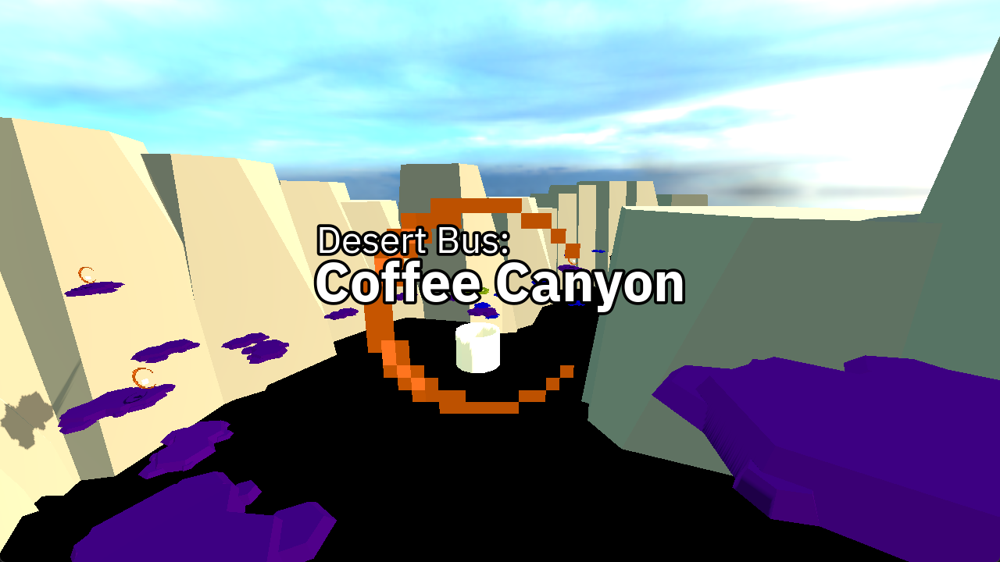

# Desert Bus For Hope 2023 Game Jam

This is the repository an entry in the [Desert Bus For Hope 2023 Game Jam](https://itch.io/jam/2023).

**Theme:** Coffee Quest

This is a simple platformer where you help the Caff-ordinator collect all the coffee they've spilled in Coffee Canyon and deliver it to the Omega Shift.

Latest version is hosted at https://demo.tracteur.dev/dbgj2023/

Source Code is hosted at https://github.com/tracteurblinde/dbgj2023

Itch.io page is hosted at https://tracteurblinde.itch.io/desert-bus-coffee-canyon

## Credits
Concept, design and code - Tracteur Blindé

Desert Bus Gamejam Logo - Featherweight

tracteurbot - Lance Ferrantino

Textures:
- Skybox - [Polyhaven](https://polyhaven.com/)
- Pixel Art Effects - [henrysoftware](https://henrysoftware.itch.io/pixel-effects)

Models:
 - Casual Player - [Quaternius](https://quaternius.com/)
 - Rocks - [Kenney](https://kenney.nl/)

This project uses the [Godot Engine](https://godotengine.org/) and the following Godot Plugins and Assets:
- [Dialogic](https://github.com/coppolaemilio/dialogic)
- [Godot-4.1-Third-Person-Controller](https://github.com/WaffleAWT/Godot-4.1-Third-Person-Controller)

## License

The code for this project is dual licensed under the MIT and Apache 2.0 licenses. Please see `license-mit` and `license-apache` for more details.

Assets created for the game jam are licensed under the [CC0 1.0 Universal](https://creativecommons.org/publicdomain/zero/1.0/) license. Please see `license-cc0` for more details.

Other assets are licensed under their respective licenses. Each directory within `project/3pp` should have a `license` file containing the license for the assets in that directory.
